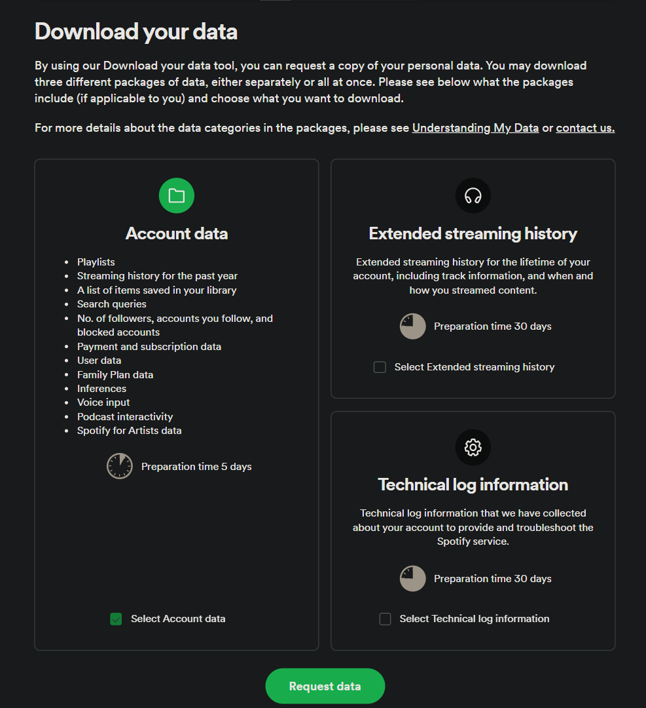

# Spoti-Stats
 Python Project to analyse your Spotify Data<br>
 **Work in progress**<br>
 Until then, let's get to know how to import your data from Spotify!

 ## Spotify Import Guide
 ### **1. Request your data from Spotify**<br>
 In order to request the ```endsong.json``` files, simply press the correct buttons on the [Spotify](https://open.spotify.com/) website.
   1.  To get started, open the [Privacy page](https://www.spotify.com/account/privacy/) on the Spotify website.
   2.  Scroll down to the "Download your data" section.
   
   3.  Make sure to only tick the box in the "**Account data**" panel. 
   4.  Press the "Request data" button.

